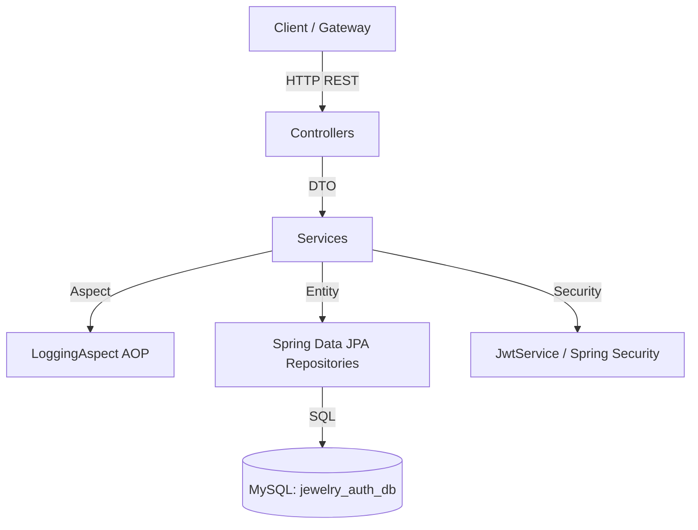

# Auth Service — Jewelry Store Microservices

Production-Quality Authentication & Authorization Microservice built with Spring Boot 3, Spring Security 6, JWT, and MySQL.

---

## 1. Project Overview
The **Auth Service** is an independent core service responsible for user registration, authentication, token management (Access & Refresh Tokens), role management, account status enforcement, and user profiles in an Online Jewelry Store microservices ecosystem.

---

## 2. Auth Service Responsibilities
- User Registration & Role Assignment
- Login & JWT Token Generation
- Token Refresh with Rotation & Revocation
- Logout Strategy (Server-side refresh token invalidation)
- User Profile Updates & Password Change
- Admin User Management & Account Status Control (ACTIVE, INACTIVE, LOCKED, SUSPENDED)

---

## 3. Architecture
The service follows a clean layered microservices architecture:



---

## 4. Technology Stack
- **Java**: 17 / 21
- **Framework**: Spring Boot 3.2.5
- **Security**: Spring Security 6, JJWT 0.12.5
- **Database**: MySQL 8.0, Spring Data JPA, Hibernate
- **Tooling**: Lombok, MapStruct 1.5.5, Spring Boot Actuator, Springdoc OpenAPI 2.5.0
- **Testing**: JUnit 5, Mockito, Testcontainers

---

## 5. Package Structure
```text
com.jewelry.auth
├── aspect
│   └── LoggingAspect
├── config
│   ├── JwtConfig
│   ├── OpenApiConfig
│   └── SecurityConfig
├── controller
│   ├── AdminController
│   ├── AuthController
│   └── UserController
├── dto
│   ├── request
│   │   ├── ChangePasswordRequest
│   │   ├── LoginRequest
│   │   ├── RefreshTokenRequest
│   │   ├── RegisterRequest
│   │   └── UpdateProfileRequest
│   └── response
│       ├── AuthResponse
│       ├── TokenResponse
│       └── UserResponse
├── entity
│   ├── RefreshToken
│   ├── Role
│   ├── User
│   └── enums
│       ├── AccountStatus
│       └── RoleName
├── exception
│   ├── BadRequestException
│   ├── ErrorResponse
│   ├── GlobalExceptionHandler
│   ├── InvalidCredentialsException
│   ├── InvalidTokenException
│   ├── ResourceNotFoundException
│   ├── TokenExpiredException
│   ├── UserAlreadyExistsException
│   └── ValidationErrorResponse
├── mapper
│   └── UserMapper
├── repository
│   ├── RefreshTokenRepository
│   ├── RoleRepository
│   └── UserRepository
├── security
│   ├── CustomUserDetails
│   ├── CustomUserDetailsService
│   └── JwtAuthenticationFilter
└── service
    ├── AuthService
    ├── JwtService
    ├── RefreshTokenService
    ├── UserService
    └── impl
        ├── AuthServiceImpl
        ├── JwtServiceImpl
        ├── RefreshTokenServiceImpl
        └── UserServiceImpl
```

---

## 6. API Documentation

### Public Endpoints (`/api/v1/auth`)
- `POST /api/v1/auth/register` — Register customer
- `POST /api/v1/auth/login` — Login user & receive JWT access + refresh token
- `POST /api/v1/auth/refresh` — Rotate refresh token & issue new access token

### Authenticated Endpoints (`/api/v1/auth` & `/api/v1/users`)
- `POST /api/v1/auth/logout` — Revoke user refresh tokens
- `GET /api/v1/users/me` — Get user profile
- `PATCH /api/v1/users/me` — Update profile
- `PATCH /api/v1/users/me/password` — Change password & revoke refresh tokens

### Admin Endpoints (`/api/v1/admin/users`)
- `GET /api/v1/admin/users` — List users (Paginated)
- `GET /api/v1/admin/users/{id}` — Get user details
- `PATCH /api/v1/admin/users/{id}/status` — Update account status (`ACTIVE`, `INACTIVE`, `LOCKED`, `SUSPENDED`)

---

## 7. Docker Setup

To run Auth Service and MySQL using Docker Compose:

```bash
docker-compose up -d --build
```

---

## 8. Swagger UI
Access OpenAPI documentation at: `http://localhost:8081/swagger-ui.html`
