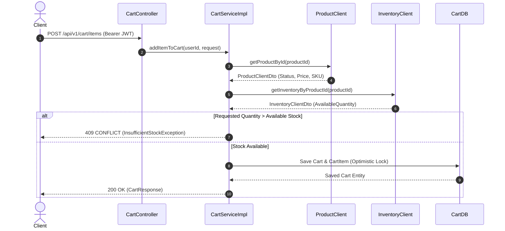
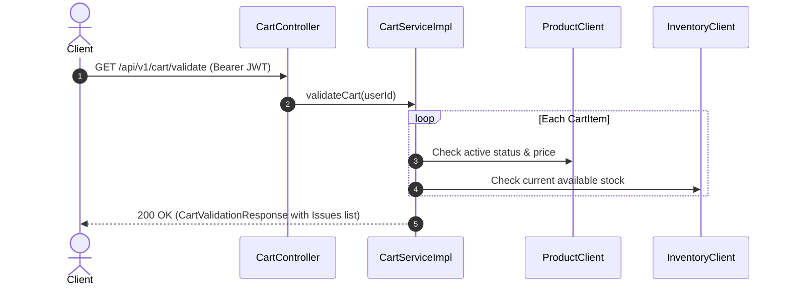

# Cart Service — Online Jewelry Store Microservices

Production-ready Cart Microservice for the Online Jewelry Store ecosystem built with **Spring Boot 3.2**, **Java 20/21**, **Spring Data JPA**, **OpenFeign**, and **Spring Security (Stateless JWT)**.

---

## 1. Overview
The Cart Service manages user shopping carts, item additions, quantity updates, removals, total amount calculations, and pre-checkout validation. It is isolated within its own database boundary (`jewelry_cart_db`) and communicates asynchronously or via synchronous REST/OpenFeign clients with `PRODUCT-SERVICE` and `INVENTORY-SERVICE`.

---

## 2. Microservice Architecture

```text
                         Angular Frontend
                                |
                                v
                         API Gateway :8080
                                |
       +------------------------+-------------------------+
       |                        |                         |
       v                        v                         v
 Auth Service             Product Service          Inventory Service
    :8081                     :8082                     :8083
       |                        |                         |
jewelry_auth_db          jewelry_product_db       jewelry_inventory_db


                                |
                                v
                           Cart Service
                              :8084
                                |
                         jewelry_cart_db
                              MySQL
```

---

## 3. Database Design & Tables

Owned exclusively by Cart Service: **`jewelry_cart_db`**

### Carts Table (`carts`)
| Column | Type | Constraints | Description |
|---|---|---|---|
| `id` | BIGINT | PRIMARY KEY, AUTO_INCREMENT | Cart Identifier |
| `user_id` | BIGINT | UNIQUE, NOT NULL | Owning User ID (derived from JWT) |
| `total_amount` | DECIMAL(12,2) | NOT NULL | Computed Cart Total |
| `version` | BIGINT | NOT NULL | Optimistic Locking Version |
| `created_at` | DATETIME | NOT NULL | Creation Audit Timestamp |
| `updated_at` | DATETIME | NOT NULL | Last Update Audit Timestamp |

### Cart Items Table (`cart_items`)
| Column | Type | Constraints | Description |
|---|---|---|---|
| `id` | BIGINT | PRIMARY KEY, AUTO_INCREMENT | Cart Item Identifier |
| `cart_id` | BIGINT | FOREIGN KEY (`carts.id`), NOT NULL | Owning Cart ID |
| `product_id` | BIGINT | NOT NULL | Downstream Product ID |
| `sku` | VARCHAR(100) | NOT NULL | Product SKU |
| `product_name` | VARCHAR(255) | NOT NULL | Product Snapshot Name |
| `product_image` | VARCHAR(500) | NULL | Product Image URL |
| `unit_price` | DECIMAL(12,2) | NOT NULL | Product Snapshot Price |
| `quantity` | INT | NOT NULL | Quantity in cart |
| `subtotal` | DECIMAL(12,2) | NOT NULL | `unit_price * quantity` |

### Database Constraints & Indexes
- **Unique Constraint**: `uk_carts_user_id` on `carts(user_id)` (One active cart per user).
- **Unique Constraint**: `uk_cart_items_cart_product` on `cart_items(cart_id, product_id)` (No duplicate line items for same product).
- **Indexes**: `idx_carts_user_id`, `idx_cart_items_cart_id`, `idx_cart_items_product_id`.

---

## 4. Architectural Design Decisions

### A. Price & Product Snapshot Strategy
- **Why store snapshot?** Storing `productName`, `sku`, `productImage`, and `unitPrice` inside `CartItem` enables fast cart retrieval without hitting Product Service on every single `GET /api/v1/cart`.
- **Pre-checkout Validation**: Because prices and status can change, the client or Order Service must invoke `GET /api/v1/cart/validate` prior to checkout to compare snapshot prices and active flags against live Product Service data.

### B. Stock Availability vs. Stock Reservation
- **Cart operations DO NOT reserve stock**. Adding or updating items in cart only checks stock availability (`availableQuantity >= requestedQuantity`).
- **Stock Reservation**: Actual reservation occurs downstream during Order placement / Checkout.

### C. Cart Ownership Enforcement
- `userId` is extracted strictly from the validated JWT claims (`SecurityContextHolder`).
- Request body or path parameters cannot override or specify `userId`. Users can only view or mutate their own cart.

---

## 5. Sequence Flows (Mermaid Diagrams)

### Add to Cart Flow



### Pre-Checkout Cart Validation Flow



---

## 6. API Endpoints Reference

All endpoints require `Authorization: Bearer <token>`.

| Method | Endpoint | Description | Status Codes |
|---|---|---|---|
| `GET` | `/api/v1/cart` | Get current user cart (auto-creates empty cart if none exists) | `200`, `401` |
| `POST` | `/api/v1/cart/items` | Add product item to cart (validates product & inventory) | `200`, `400`, `401`, `409`, `503` |
| `PUT` | `/api/v1/cart/items/{itemId}` | Update item quantity in cart | `200`, `404`, `409` |
| `DELETE` | `/api/v1/cart/items/{itemId}` | Remove specific item from cart | `200`, `404` |
| `DELETE` | `/api/v1/cart` | Clear all items from current cart | `200`, `401` |
| `GET` | `/api/v1/cart/validate` | Validate cart items, stock, and prices before checkout | `200`, `401` |

---

## 7. Configuration & Running

### Environment Variables
- `DB_URL`: JDBC Connection String (Default: `jdbc:mysql://localhost:3306/jewelry_cart_db`)
- `DB_USERNAME`: Database user (Default: `root`)
- `DB_PASSWORD`: Database password
- `JWT_SECRET`: Base64 HMAC SHA secret key
- `SERVER_PORT`: HTTP Port (Default: `8084`)
- `PRODUCT_SERVICE_URL`: Downstream Product Service URL
- `INVENTORY_SERVICE_URL`: Downstream Inventory Service URL

### Run Locally
```bash
./mvnw clean spring-boot:run
```

### Run via Docker Compose
```bash
docker-compose up --build -d
```

### OpenAPI / Swagger UI
Access OpenAPI documentation at:
`http://localhost:8084/swagger-ui.html`
