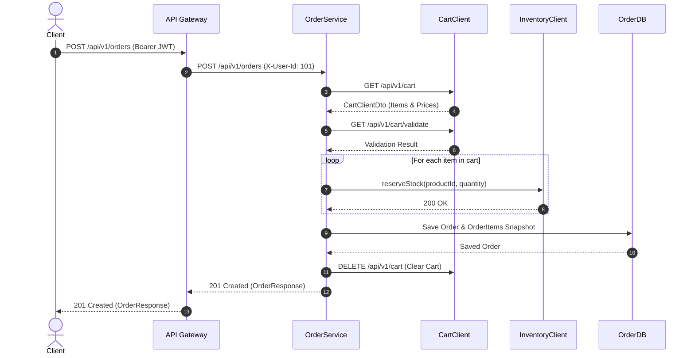
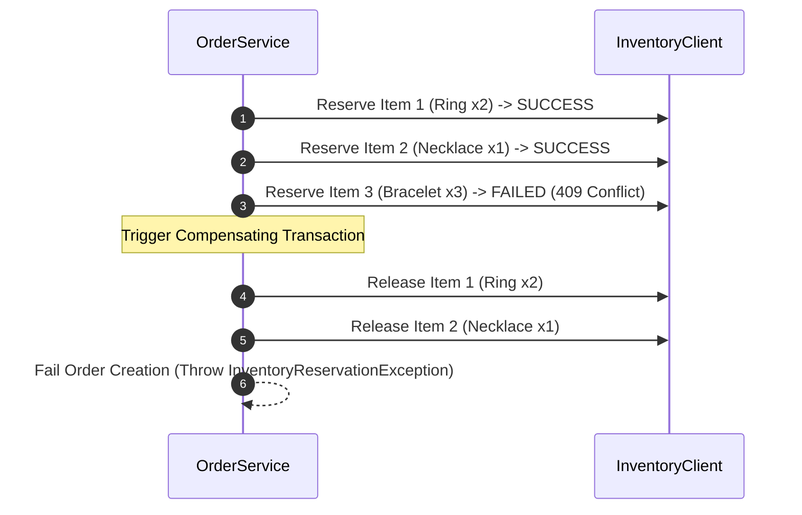

# Order Service — Online Jewelry Store Microservices

Production-ready Order Microservice for the Online Jewelry Store ecosystem built with **Spring Boot 3.2**, **Java 20/21**, **Spring Data JPA**, **OpenFeign**, and **API Gateway Header Security Integration (`X-User-Id`)**.

---

## 1. Overview
The Order Service orchestrates order creation from user shopping carts, manages line item product snapshots, validates pre-checkout inventory, executes stock reservations and compensating actions, enforces controlled order state transitions, and handles user idempotency keys.

---

## 2. Microservice Architecture

```text
                         Angular Frontend
                                |
                                v
                         API Gateway :8080
                                |
                 Authentication + Authorization
                                |
          +---------------------+---------------------+
          |                     |                     |
          v                     v                     v
     Product Service      Inventory Service       Cart Service
         :8082                 :8083                  :8084
          |                     |                     |
          v                     v                     v
   jewelry_product_db    jewelry_inventory_db    jewelry_cart_db
         MySQL                 MySQL                  MySQL

                                |
                                v
                          Order Service
                              :8085
                                |
                         jewelry_order_db
                              MySQL
```

---

## 3. Security Architecture (`X-User-Id`)
This microservice **does NOT implement Spring Security or JWT filters internally**. Authentication and authorization are offloaded to the **API Gateway**.
- The API Gateway authenticates user JWTs and injects the trusted identity header `X-User-Id: 101`.
- The `CurrentUserProvider` component reads and validates the presence of `X-User-Id`. If missing or invalid, it returns `400 BAD REQUEST`.

---

## 4. Database Design & Tables (`jewelry_order_db`)

### Orders Table (`orders`)
| Column | Type | Constraints | Description |
|---|---|---|---|
| `id` | BIGINT | PRIMARY KEY, AUTO_INCREMENT | Order Identifier |
| `order_number` | VARCHAR(50) | UNIQUE, NOT NULL | Human-friendly order number (e.g. `ORD-20260819-A1B2C3`) |
| `user_id` | BIGINT | NOT NULL | Owning User ID |
| `status` | VARCHAR(30) | NOT NULL | Order status (`CONFIRMED`, `PROCESSING`, etc.) |
| `payment_status` | VARCHAR(30) | NOT NULL | Payment status (`PENDING`, `PAID`, etc.) |
| `total_amount` | DECIMAL(12,2) | NOT NULL | Order total |
| `shipping_full_name` | VARCHAR(150) | NOT NULL | Address snapshot full name |
| `shipping_phone_number` | VARCHAR(20) | NOT NULL | Address snapshot phone |
| `shipping_address_line1` | VARCHAR(255) | NOT NULL | Street address line 1 |
| `shipping_city` | VARCHAR(100) | NOT NULL | City snapshot |
| `shipping_state` | VARCHAR(100) | NOT NULL | State snapshot |
| `shipping_postal_code` | VARCHAR(20) | NOT NULL | Postal code snapshot |
| `shipping_country` | VARCHAR(100) | NOT NULL | Country snapshot |
| `version` | BIGINT | NOT NULL | Optimistic locking version |

### Order Items Table (`order_items`)
| Column | Type | Constraints | Description |
|---|---|---|---|
| `id` | BIGINT | PRIMARY KEY, AUTO_INCREMENT | Line item ID |
| `order_id` | BIGINT | FOREIGN KEY (`orders.id`) | Owning Order |
| `product_id` | BIGINT | NOT NULL | Purchased Product ID |
| `sku` | VARCHAR(100) | NOT NULL | Purchased Product SKU |
| `product_name` | VARCHAR(255) | NOT NULL | Purchased product name snapshot |
| `unit_price` | DECIMAL(12,2) | NOT NULL | Purchased unit price snapshot |
| `quantity` | INT | NOT NULL | Purchased quantity |
| `subtotal` | DECIMAL(12,2) | NOT NULL | Line item subtotal (`unit_price * quantity`) |

---

## 5. Sequence Flows (Mermaid Diagrams)

### Order Creation Flow



### Inventory Compensation Flow



---

## 6. API Endpoints Reference

| Method | Endpoint | Access Level | Description |
|---|---|---|---|
| `POST` | `/api/v1/orders` | Customer | Places order from cart with stock reservation & optional `Idempotency-Key` |
| `GET` | `/api/v1/orders` | Customer | Gets paginated order history for authenticated user |
| `GET` | `/api/v1/orders/{orderId}` | Customer | Gets order details by ID (enforces ownership) |
| `POST` | `/api/v1/orders/{orderId}/cancel` | Customer | Cancels order and releases reserved inventory |
| `GET` | `/api/v1/admin/orders` | Admin | Gets paginated orders across all users |
| `GET` | `/api/v1/admin/orders/{orderId}` | Admin | Gets order details by ID for admin |
| `PATCH` | `/api/v1/admin/orders/{orderId}/status` | Admin | Updates order status following state transition rules |

---

## 7. Configuration & Running

### Environment Variables
- `DB_URL`: JDBC Connection String (Default: `jdbc:mysql://localhost:3306/jewelry_order_db`)
- `DB_USERNAME`: Database user (Default: `root`)
- `DB_PASSWORD`: Database password
- `SERVER_PORT`: HTTP Port (Default: `8085`)
- `CART_SERVICE_URL`: Downstream Cart Service URL
- `PRODUCT_SERVICE_URL`: Downstream Product Service URL
- `INVENTORY_SERVICE_URL`: Downstream Inventory Service URL

### Run Locally
```bash
./mvnw clean spring-boot:run
```

### Run via Docker Compose
```bash
docker-compose up --build -d
```
