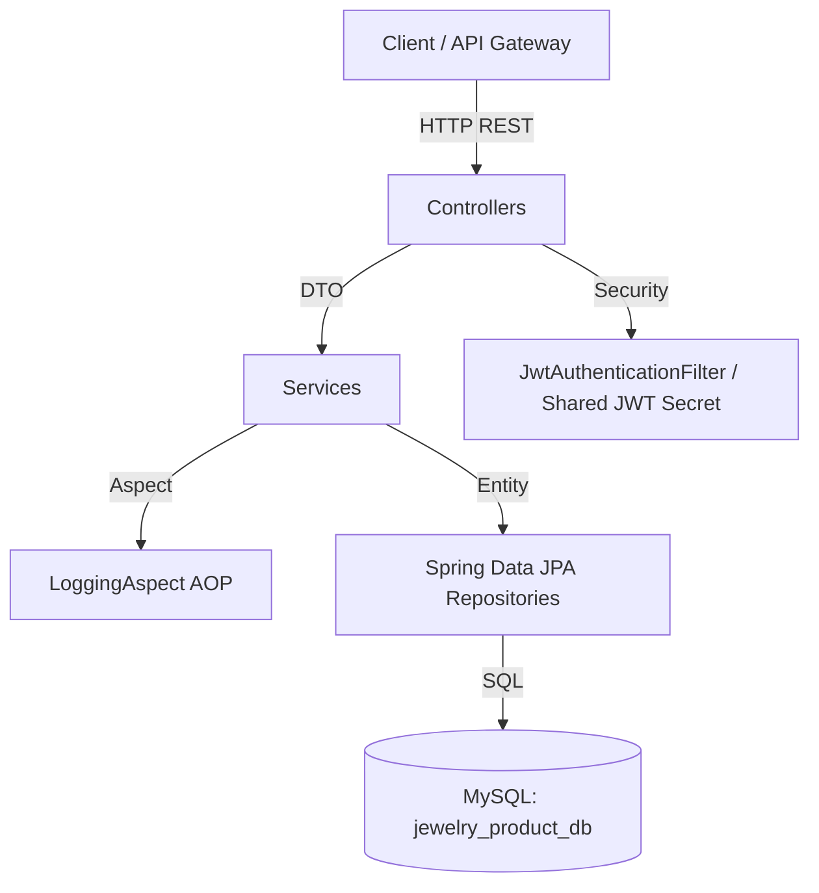

# Product Service — Jewelry Store Microservices

Production-Quality Product & Catalog Management Microservice built with Spring Boot 3, Spring Data JPA, Hibernate, and MySQL.

---

## 1. Overview
The **Product Service** is an independent core microservice responsible for managing jewelry products, catalog search, filtering, category hierarchies, pricing calculation, image URL management, and administration.

---

## 2. Architecture
The service follows a clean layered microservices architecture and maintains total autonomy over its own database (`jewelry_product_db`).



---

## 3. Technology Stack
- **Java**: 17 / 21
- **Framework**: Spring Boot 3.2.5
- **Database**: MySQL 8.0, Spring Data JPA, Hibernate
- **Security**: Spring Security 6 (Stateless JWT validation)
- **Tooling**: Lombok, MapStruct 1.5.5, Spring Boot Actuator, Springdoc OpenAPI 2.5.0
- **Testing**: JUnit 5, Mockito, Testcontainers

---

## 4. Package Structure
```text
com.jewelry.product
├── aspect
│   └── LoggingAspect
├── config
│   ├── JwtConfig
│   ├── OpenApiConfig
│   └── SecurityConfig
├── controller
│   ├── AdminProductController
│   ├── CategoryController
│   └── ProductController
├── dto
│   ├── request
│   │   ├── CreateCategoryRequest
│   │   ├── CreateProductRequest
│   │   ├── ProductImageRequest
│   │   ├── UpdateCategoryRequest
│   │   └── UpdateProductRequest
│   └── response
│       ├── CategoryResponse
│       ├── PageResponse
│       ├── ProductImageResponse
│       ├── ProductResponse
│       └── ProductSummaryResponse
├── entity
│   ├── Category
│   ├── Product
│   ├── ProductImage
│   └── enums
│       ├── CategoryStatus
│       ├── Gender
│       ├── MetalType
│       ├── ProductStatus
│       └── StoneType
├── exception
│   ├── BadRequestException
│   ├── CategoryNotFoundException
│   ├── DuplicateProductException
│   ├── ErrorResponse
│   ├── GlobalExceptionHandler
│   ├── ProductNotFoundException
│   └── ValidationErrorResponse
├── filter
│   └── CorrelationIdFilter
├── mapper
│   ├── CategoryMapper
│   └── ProductMapper
├── repository
│   ├── CategoryRepository
│   └── ProductRepository
├── security
│   ├── CustomJwtService
│   └── JwtAuthenticationFilter
└── service
    ├── CategoryService
    ├── ProductService
    └── impl
        ├── CategoryServiceImpl
        └── ProductServiceImpl
```

---

## 5. Database Schema & Indexes

### Tables:
- `categories` (`id`, `name`, `description`, `status`, `created_at`, `updated_at`)
- `products` (`id`, `sku`, `name`, `description`, `category_id`, `price`, `discount_percentage`, `metal_type`, `purity`, `stone_type`, `weight`, `gender`, `status`, `created_at`, `updated_at`)
- `product_images` (`product_id`, `image_url`, `alt_text`, `primary_image`)

### Indexes:
- `idx_product_sku` on `products(sku)` (Unique constraint)
- `idx_product_name` on `products(name)`
- `idx_product_category_id` on `products(category_id)`
- `idx_product_metal_type` on `products(metalType)`
- `idx_product_stone_type` on `products(stoneType)`
- `idx_product_price` on `products(price)`
- `idx_product_status` on `products(status)`
- `idx_product_created_at` on `products(createdAt)`

---

## 6. API Endpoints

### Public Endpoints
- `GET /api/v1/products` — Paginated, filtered, and searched list of active products.
- `GET /api/v1/products/{id}` — Full details for a single product.
- `GET /api/v1/products/sku/{sku}` — Lookup product by unique SKU.
- `GET /api/v1/categories` — List all categories.
- `GET /api/v1/categories/{id}` — Get category by ID.

### Admin Endpoints (`ROLE_ADMIN` Required)
- `POST /api/v1/admin/products` — Create product.
- `PUT /api/v1/admin/products/{id}` — Update product details.
- `PATCH /api/v1/admin/products/{id}/status` — Soft delete / change product status (`ACTIVE`, `INACTIVE`, `ARCHIVED`).
- `GET /api/v1/admin/products` — List all products across any status.
- `POST /api/v1/admin/categories` — Create category.
- `PUT /api/v1/admin/categories/{id}` — Update category.
- `PATCH /api/v1/admin/categories/{id}/status` — Change category status.

---

## 7. Pricing Calculation

Formula applied centrally in `ProductMapper`:
$$\text{finalPrice} = \text{price} - \left(\text{price} \times \frac{\text{discountPercentage}}{100}\right)$$
Result is rounded using `RoundingMode.HALF_UP` to two decimal places.

---

## 8. Docker Setup

To run Product Service alongside MySQL:
```bash
docker-compose up -d --build
```

---

## 9. Swagger UI
Access OpenAPI documentation at: `http://localhost:8082/swagger-ui.html`
